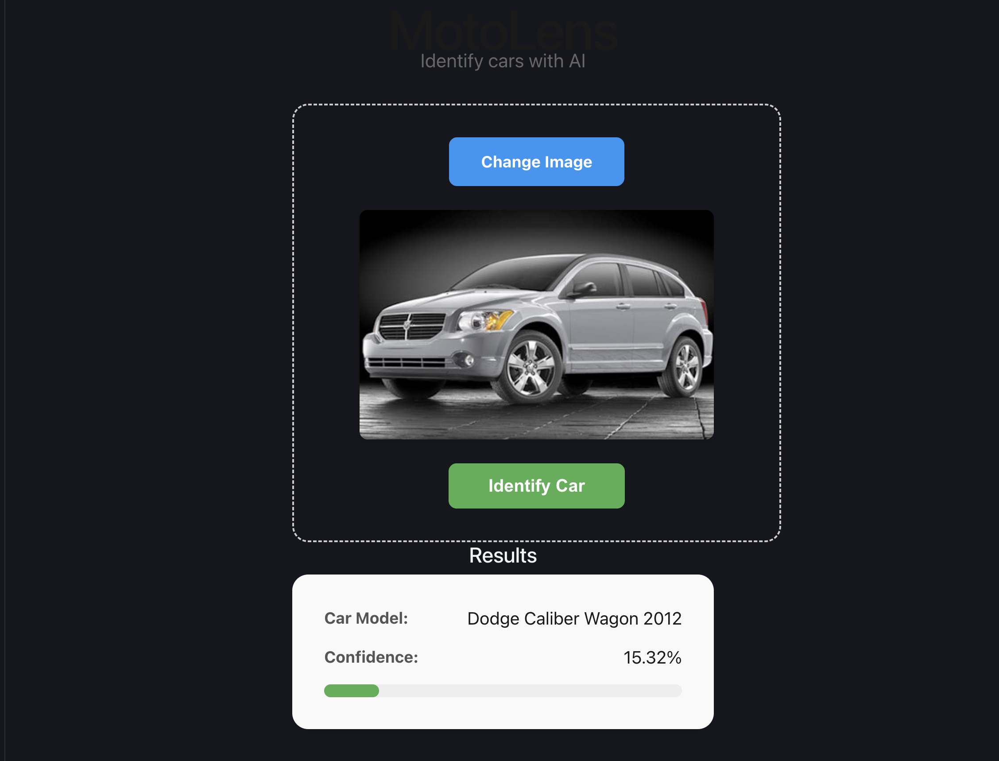

# MotoLens 🏎️ - Identify Cars with AI

**MotoLens** is a full-stack AI application that acts as a "Shazam for Cars." Upload an image of a car, and our deep learning model will identify its make and model along with a confidence score.

## ✨ Features

- **Real-time Identification:** High-speed inference using a pre-trained ResNet-50 model.
- **Transfer Learning:** Custom-trained on 196 car classes.
- **Modern UI:** Clean React interface with drag-and-drop support (via file picker) and live previews.
- **Confidence Visualization:** See how certain the AI is about its prediction with a visual confidence bar.

## 🛠️ Tech Stack

### **Backend**

- **Python / FastAPI:** High-performance asynchronous web framework.
- **PyTorch / Torchvision:** For loading and running the ResNet-50 model.
- **Pillow (PIL):** For image preprocessing.
- **Uvicorn:** ASGI server for production-grade serving.

### **Frontend**

- **React (TypeScript):** Type-safe UI development.
- **Vite:** Next-generation frontend tooling for fast builds.
- **Axios:** For robust API communication.
- **CSS3:** Custom responsive styling.

---

## 📸 Example



1. **Upload:** Select an image from your device.
2. **Predict:** Click "Identify Car" to process the image.
3. **Result:** View the car model name and a percentage-based confidence score.

---

## 🚀 Setup & Run Instructions

### **Prerequisites**

- **Anaconda/Miniconda** (for Python environment)
- **Node.js & npm** (for the React frontend)

### **1. Backend Setup**

```bash
# Navigate to the backend directory
cd backend

# (Optional) Create and activate a virtual environment
# python -m venv venv
# source venv/bin/activate  # On Windows: venv\Scripts\activate

# Install required dependencies
pip install -r requirements.txt

# Start the FastAPI server
python main.py
```

### **2. Frontend Setup**

```bash
# Navigate to the frontend directory
cd frontend

# Install dependencies (only required once)
npm install

# Start the Vite development server
npm run dev
```

### **3. Access the App**

Open your browser and navigate to **`http://localhost:5173`**.

---

## 📂 Project Structure

- `backend/`: FastAPI application, model weights (`moto_lens_model.pth`), and inference logic.
- `frontend/`: React source code, components, and styling.
- `data/`: Training and testing datasets (if available).
- `model.py`: Original script used for training the model.

---

## 🤝 Contributing

Feel free to fork this project and submit pull requests for any features or bug fixes!
